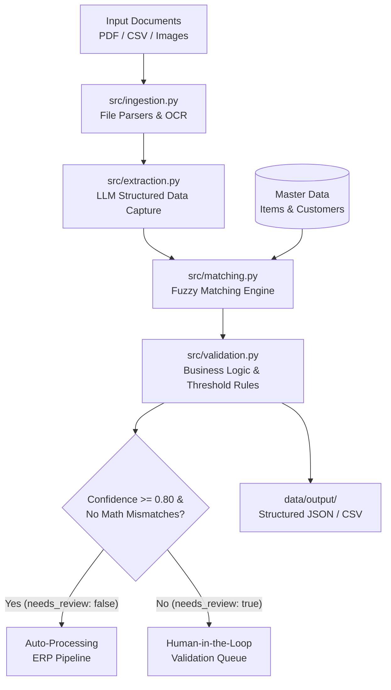

## Architecture & Engineering Trade-offs

### Hybrid Extraction Strategy
To strike a balance between accuracy and cost, the solution utilizes a hybrid approach:
1. **Deterministic Processing (`src/ingestion.py` & `src/matching.py`):** Structural parsing (PDF text / CSV) combined with `RapidFuzz` for item/customer master data lookup. Fuzzy matching operates on string similarity (`score_cutoff=80.0`) to account for typos and line-item layout variations.
2. **LLM Extraction (`src/extraction.py`):** Utilizes structured outputs (JSON schema enforcing) via open-source or commercial models (e.g., Llama-3-70B via vLLM / Ollama or GPT-4o-mini) to handle irregular layouts, multi-page PDFs, and varying document vocabulary.

---

### System Architecture Workflow

---

## Confidence Thresholds & Human-in-the-Loop Workflow

### Threshold Selection Mechanics
- **Item Level (`match_confidence`):** A strict threshold of **0.80** is applied to fuzzy matching. Items falling below 0.80 are flagged with `needs_review = True`.
- **Document Level (`confidence`):** Aggregated score based on overall schema completeness and extraction accuracy.
- **Routing Rules:**
  - Automatic processing is **only** granted when `needs_review == False` AND all mandatory fields (`document_number`, `customer_id`, line items) are populated with high confidence.
  - Any discrepancy (math mismatch between quantity * price vs total price, unknown customer ID, low string similarity) automatically forces `needs_review = True`.

### User Correction Flow (UI / Downstream Integration)
1. **Queue Assignment:** Documents flagged with `needs_review = True` are routed to a human validation interface.
2. **Side-by-Side Review:** The UI displays the original PDF/image side-by-side with extracted JSON fields. Low-confidence fields are highlighted in red.
3. **Feedback Loop:** Corrections made by operators update the Master Data aliases or provide fine-tuning pairs for future extraction adjustments.

---

## Production Considerations

### 1. Deployment & Scalability
- **Containerization:** The app is fully Dockerized for stateless execution on Kubernetes (EKS / GKE) or serverless container services (AWS ECS / Azure Container Apps).
- **Asynchronous Processing:** Production workloads should place incoming files into an S3/GCS bucket triggering an asynchronous message queue (RabbitMQ / AWS SQS) consumed by worker nodes running `DocumentPipeline`.

### 2. Security & Compliance
- **Data Privacy:** Raw document payloads and extracted PII/financial data are encrypted at rest (KMS) and in transit (TLS 1.3).
- **LLM Isolation:** Open-source models deployed inside a private VPC ensure zero sensitive financial data leaks to public APIs.

### 3. Monitoring & Quality Control
- **Observability:** Prometheus metrics track processing latency, LLM token usage, and the ratio of automated vs. human-reviewed documents (`auto_approval_rate`).
- **Drift Detection:** Drift in extraction confidence prompts re-evaluation of prompt templates or Master Data indexing.

### 4. Cost Optimization
- **Tiered Inference:** Use lightweight OCR/regex parsers for standard recurring document templates, escalating to LLM inference only for unstructured or non-standard formats.

---

## Known Assumptions & Failure Cases
1. **Handwritten Documents:** Current OCR assumes printed text; low-quality handwritten scans may require specialized vision models.
2. **Large Multi-Page Tables:** Items spanning across 5+ pages might exceed standard context windows or table boundary parsers if not chunked properly.
3. **Ambigious Master Data:** Extremely short item descriptions (e.g., "Bolt 5mm") may produce multiple fuzzy matches with identical confidence scores.
