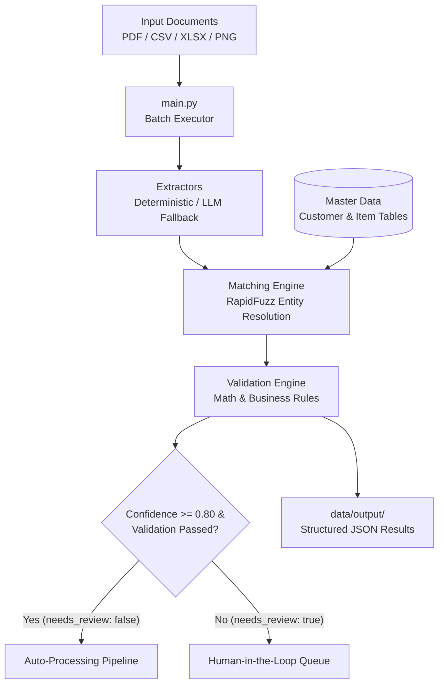

# AI Document Processing Agent

An automated, production-ready pipeline designed to ingest, extract, validate, and match structured data from multi-format business documents (purchase orders, invoices, price lists) against enterprise Master Data.

---

## 🌟 Key Features
- **Multi-Format Ingestion**: Supports `.csv`, `.xlsx`, `.pdf`, and image formats (`.png`, `.jpg`, `.jpeg`).
- **Hybrid Extraction Engine**:  
  - **Deterministic Parsing**: Native layout processing for structured spreadsheets and tabular data.  
  - **LLM-Powered Extraction**: Fallback vision/text extraction via Groq API (e.g., Qwen/Llama models) for unstructured invoices, scans, and irregular PDFs.
- **Master Data Entity Resolution**: Automated fuzzy matching (`RapidFuzz`) against Customer and Item master datasets with configurable confidence cutoffs.
- **Business Logic & Math Validation**: Automated checks for quantity/unit price consistency, tax/shipping totals, missing required fields, and customer identification.
- **Batch Processing & Rate Limiting**: Processes all files in `data/raw/` in batch mode with built-in throttling to prevent API rate limit issues (HTTP 429).
- **Human-in-the-Loop (HITL) Readiness**: Automatic flagging (`needs_review: true`) with detailed reasons when confidence drops or validation fails.

---

### 🏗 System Architecture Workflow


```mermaid
flowchart TD
    A[Input Documents\nPDF / CSV / XLSX / PNG] --> B[main.py\nBatch Executor]
    B --> C[Extractors\nDeterministic / LLM Fallback]
    
    C --> D[Matching Engine\nRapidFuzz Entity Resolution]
    E[(Master Data\nCustomer & Item Tables)] --> D
    
    D --> F[Validation Engine\nMath & Business Rules]
    
    F --> G{Confidence >= 0.80 &\nValidation Passed?}
    G -- Yes (needs_review: false) --> H[Auto-Processing Pipeline]
    G -- No (needs_review: true) --> I[Human-in-the-Loop Queue]
    
    F --> J[data/output/\nStructured JSON Results]
```

---

## 📁 Project Structure

```text
ai-document-processing-agent/
├── main.py # Main entry point for batch processing
├── requirements.txt # Python dependencies
├── .env # Environment variables (API keys)
├── data/
│ ├── master/ # Master Data reference files
│ │ ├── Master_Customer_Data.xlsx
│ │ └── Master_Item_Data.xlsx
│ ├── raw/ # Input documents directory
│ │ ├── invoice_supplier_0134.csv
│ │ ├── invoice_supplier_D45391.pdf
│ │ ├── order_supplier_016743.png
│ │ └── order_supplier_5429F.xlsx
│ └── output/ # Result JSON files
├── src/
│ ├── extractors/ # Base, PDF, Image, CSV/XLSX & LLM extractors
│ ├── matching.py # RapidFuzz entity matching against master data
│ ├── validation.py # Business rules & mathematical verification
│ ├── pipeline.py # Document processing pipeline orchestrator
│ └── schemas.py # Pydantic models for data validation
└── tests/ # Unit & integration tests
```

---

## 🚀 Quick Start & Setup
### Prerequisites
- **Python:** 3.10+
- **Environment:** 
`venv`, `poetry`, or `uv`
### 1. Installation
Clone the repository and install dependencies:
```bash
# Clone repository
git clone <your-repository-url>
cd ai-document-processing-agent
# Create and activate virtual environment
python -m venv .venv
source .venv/bin/activate 
# On Windows: .venv\Scripts\activate
# Install dependencies
pip install -r requirements.txt
```
### 2. Environment Configuration
Create a `.env` file in the root directory and add your Groq API key:
```env
GROQ_API_KEY=your_groq_api_key_here
```
### 3. Execution
Place your input document (PDF, Excel, CSV, Image) into `data/raw/` and run the processing pipeline:
```bash
python -m src.main
```
Outputs will be saved in `data/output/`.
### 4. Running Tests
Execute unit tests and linters:
```bash
pytest
```
---

## 🏛 Architecture & Engineering Trade-offs

### Hybrid Extraction Strategy
To strike a balance between accuracy, processing cost, and latency, the solution utilizes a hybrid approach:

- **Deterministic Parsing (`src/extractors/`, `src/matching.py`)**:
   - **Trade-off**: High speed and zero API cost, but brittle with unformatted or unseen PDF layouts.
  - **Usage**: Handles structured files (CSV, XLSX) and direct tabular extraction with `RapidFuzz` entity resolution (`score_cutoff = 80.0`).
- **LLM Fallback Extraction (`src/extractors/`, `src/pipeline.py`)**:
   - **Trade-off**: Higher latency and API cost, but handles non-standard, scanned, or complex multi-page documents.
  - **Usage**: Enforces structured JSON schema outputs via vision/text models (e.g., Llama-3 / Qwen via Groq API).
---

## 🎯 Confidence Thresholds & Human-in-the-Loop Workflow

### Threshold Selection Mechanics
- **Item Level (`match_confidence`)**: A strict threshold of **0.80** (80%) is applied to fuzzy matching. Items falling below 0.80 are flagged with `needs_review = true`.
- **Document Level (`confidence`)**: Aggregated score based on overall schema completeness and extraction accuracy.

### Routing Rules
- Automatic processing is **only** granted when `needs_review == False` AND all mandatory header fields (`document_number`, `customer_id`, line items) are populated with high confidence.
- Any discrepancy (math mismatch between `quantity × unit_price` vs total price) automatically routes the document to the Human-in-the-Loop review queue.

---

## ⚙️ Business Rules & Human-in-the-Loop (HITL)

A document is flagged for manual human review (`needs_review: true`) if any of the following triggers occur:

- **Unidentified Customer**: Customer name cannot be matched to Master Data with a score above the threshold (`score_cutoff = 80.0`).
- **Item Match Uncertainty**: Low similarity score when mapping item descriptions to internal SKUs.
- **Math Mismatch**: Discrepancy between calculated line item totals (`quantity × unit_price`) and the document header total.
- **Extraction Failure**: Missing required header fields or unparseable line item structures.

---

## 🔒 Production Considerations & Scalability

- **Scalability**: Can be packaged into Docker containers and deployed to cloud queues (AWS SQS / Azure Service Bus) for asynchronous document worker nodes.
- **Rate Limit Throttling**: The main pipeline incorporates execution delays to remain within free-tier API rate limits.
- **Data Security**: In production environments, private LLM deployments (e.g., vLLM / Ollama inside a private VPC) ensure financial data compliance and zero PII leaks.